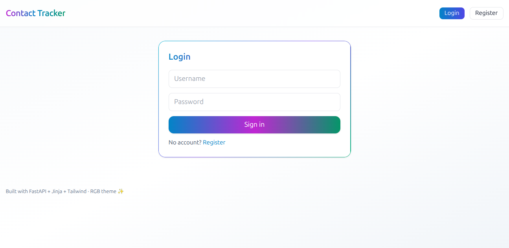
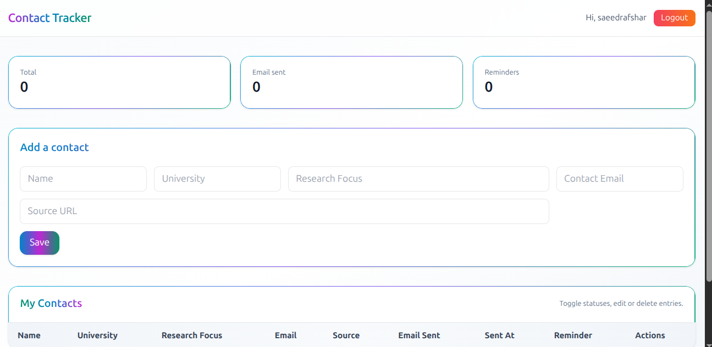
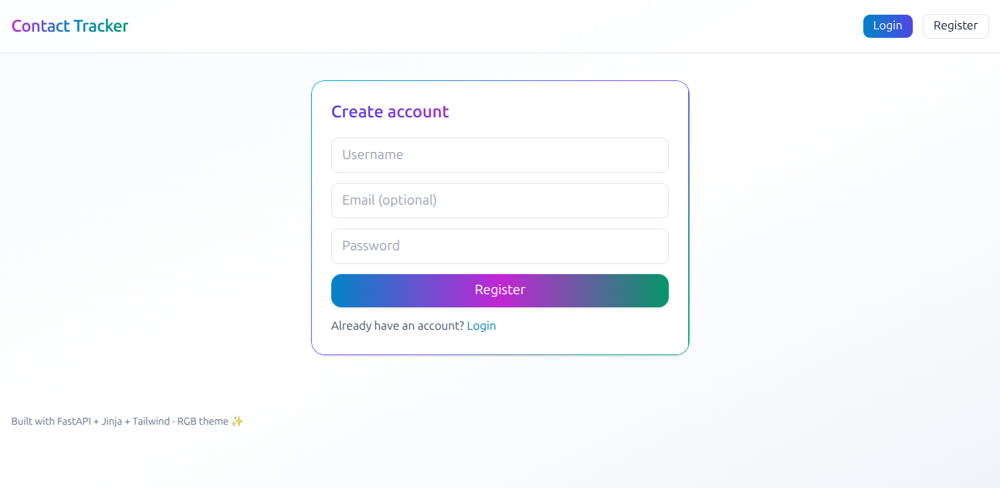

# ApplyList · Contact Tracker for Grad/Research Applications 🇮🇷✨

> A friendly, colorful web app to **track professors, labs, and outreach** while applying for **Master’s/PhD** — especially popular with students applying from **Iran to Canada/US/Europe** in **Neuroscience, ML, and CS**.

🌐 **Use it now:** **[http://applylist.ir/](http://applylist.ir/)**
🧑‍💻 **Open‑source:** MIT‑licensed — clone, fork, remix.

<div align="center">

**Organize. Email. Follow up. Win.**

🎓 🧠 🤖 🔬 📧 ⏰ ✅

</div>

---

## Why ApplyList?

Applying is chaotic — names, universities, research areas, emails, reminders… 😵‍💫
ApplyList gives you a calm, private space to manage it all.

* 📇 **Contact cards** — Name, University, Research Focus, Email, Source link
* ✉️ **Email status** — one click; saves the **date & time**
* 🔁 **Reminder status** — track follow‑ups without spreadsheets
* 🔒 **Per‑user dashboard** — your list is private to you
* 🌈 **Modern UI** — Tailwind CSS, soft gradients, mobile friendly
* ⚡ **Fast** — FastAPI + SQLite, minimal friction

> Built to help **Iranian students** and other international applicants stay organized for **grad school**, **RA/Internship**, and **scholarship** outreach.

---

## Live Demo (Screenshots)

> These are example shots; your data stays private. Replace with your own if you self‑host (see below).

<p align="center">
  
</p>

<p align="center">
  
</p>

<p align="center">
  
</p>

**How to add real screenshots:** open **[http://applylist.ir/](http://applylist.ir/)** → take 3 captures (Login, Dashboard, Edit) → save under `docs/` with the names above. The README will render them automatically on GitHub.

---

## Quick Start (hosted)

1. Visit **[http://applylist.ir/](http://applylist.ir/)**
2. Create an account (free) ✅
3. Add professors/labs (e.g., McGill IPN, Queen’s CNS)
4. Click **Email Sent** after you send an email — timestamp is saved
5. Click **Reminder Sent** when you follow up
6. Filter/search in your browser; export by printing the page to PDF if needed

---

## Tailored for your journey

**Great fit if you’re:**

* Applying from **Iran** to **Canada/US/Europe** 🎯
* Interested in **Neuroscience / ML / CS / Imaging** 🧠🤖
* Tracking potential advisors at **McGill, Queen’s, UofT, UBC, EPFL, ETH, MIT, Stanford**
* Sending cold emails, keeping notes, and planning reminders

**Seeds included:** a small starter list featuring supervisors from **McGill IPN** and **Queen’s CNS** to get you moving fast.

---

## Features at a glance

* Add / Edit / Delete contacts
* Email + Reminder toggles (with sent date for emails)
* Source URL field (where you found the lab/professor)
* Clean, colorful design; mobile‑ready
* Private per‑user panels

---

## Self‑hosting (optional)

If you prefer your own server:

```bash
python -m venv venv
source venv/bin/activate  # Windows: venv\Scripts\activate
pip install -r requirements.txt
uvicorn app.main:app --reload
```

Open **[http://localhost:8000](http://localhost:8000)**. For production, run under systemd + Nginx. The app uses SQLite by default.

---

## Contribute 💚

* Translate the UI/README (Farsi welcome!)
* Improve UX or add small features
* University‑specific templates (e.g., email drafts for McGill, UBC, EPFL)
* Open issues with ideas or bugs

If it helps your applications, please ⭐ the repo — it helps other students discover it.

---

## Privacy & License

* Your list is private to your account on **applylist.ir**
* The code is **MIT‑licensed** — free to use, modify, and deploy

---

## SEO (so students find it!)

**Keywords:** grad school contact tracker, professor outreach tool, supervisor list app, research application organizer, PhD applications Iran, Master’s applications Canada, neuroscience supervisor tracker, machine learning lab contact list, open source student CRM, FastAPI Tailwind contact tracker, apply list, applylist.

**Description:** ApplyList is an open‑source, student‑friendly web app to track professors, labs, and outreach for graduate school and research applications. Built with FastAPI, Tailwind, and SQLite. Use it free at [http://applylist.ir/](http://applylist.ir/).

---

## Thank you 🙏

Built by students, for students. Best of luck with your applications — you’ve got this! 🎉
